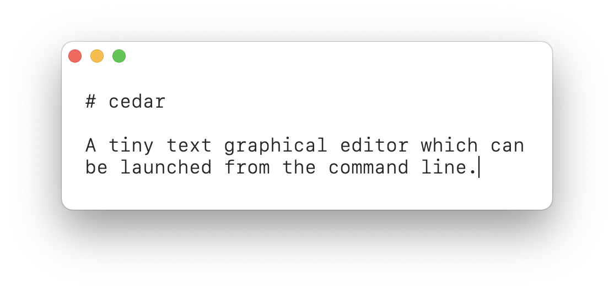

# cedar

A tiny graphical text editor for use from the command line.



## Installation

I recommend using the awesome utility [Mint](https://github.com/yonaskolb/Mint) to install cedar.

```sh
mint install danielctull-apps/cedar
```

## Usage

cedar can only be run from the command line and it takes just one argument, the file you wish to open.

```sh
cedar <file>
```

### Using as git editor

cedar is designed to open really fast so is perfect for using as a git editor. If you wish to use cedar as your editor of choice when running those beloved commands [`git commit`](https://www.git-scm.com/docs/git-commit) or [`git rebase -i`](https://www.git-scm.com/docs/git-rebase), perform the following command and it will be set in your global [git configuration](https://www.git-scm.com/book/en/v2/Customizing-Git-Git-Configuration) file.

```sh
git config --global core.editor cedar
```

## Thanks

There's code in this little app that takes heavy inspiration from the following. Thank you so much. 🧡

* [Chris Eidhof](https://github.com/chriseidhof) for his [boilerplate.swift](https://gist.github.com/chriseidhof/26768f0b63fa3cdf8b46821e099df5ff) gist which shows all the configuration needed to get a macOS app running from the command line.
* [Matt Gallagher](https://twitter.com/cocoawithlove) for his blog post [Minimalist Cocoa programming](https://www.cocoawithlove.com/2010/09/minimalist-cocoa-programming.html) which was useful background information to Chris' boilerplate gist.
* [Thiago Holanda](https://gist.github.com/unnamedd) for [MacEditorTextView](https://gist.github.com/unnamedd/6e8c3fbc806b8deb60fa65d6b9affab0), a SwiftUI text editor using NSTextView.

